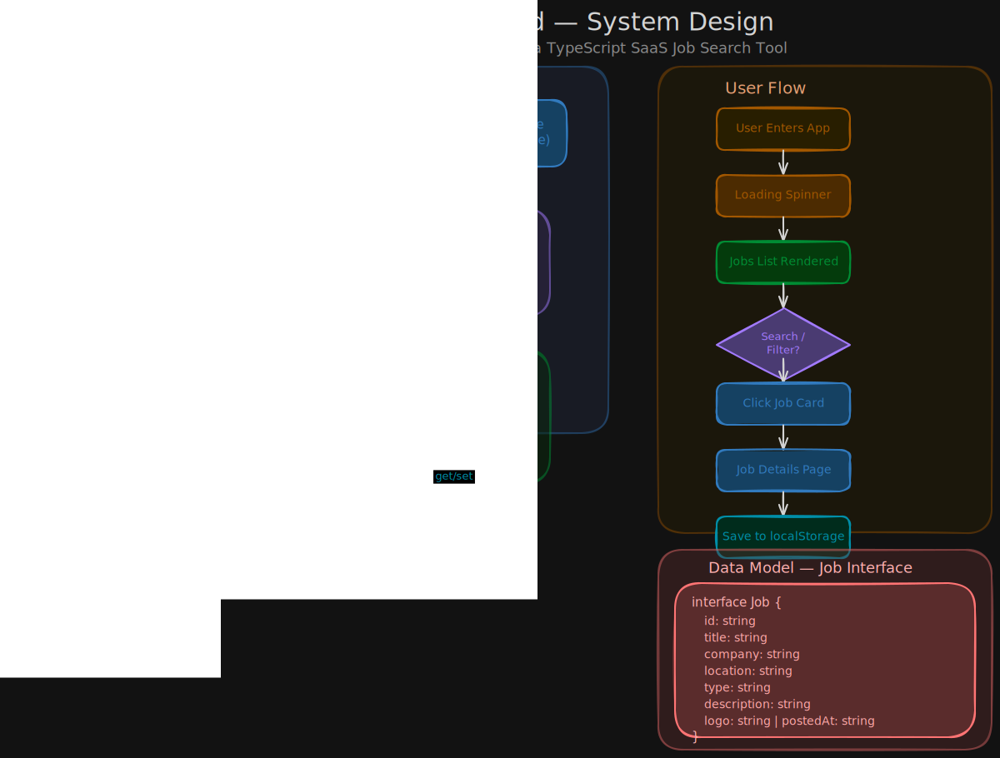

# Job Board

> A minimal SaaS-style job search tool that allows users to search, filter, and save jobs.  
> Built with Vanilla TypeScript — no frameworks, no bundlers.

---

## Getting Started

### Clone the repository

**HTTPS:**
```bash
git clone https://github.com/Cat-Div7/Job-Board.git
```

**SSH:**
```bash
git clone git@github.com:Cat-Div7/Job-Board.git
```

### Install dependencies

```bash
npm install
```

### Start the development server

```bash
npm run dev
```
> **Note:** This project currently uses mock data — no real API is connected.

---

## Project Structure

```
├── docs
│   ├── system-design.excalidraw
│   └── system-design.svg
├── src
│   ├── @types
│   │   └── job.ts
│   ├── data
│   │   └── mockJobs.ts
│   ├── render
│   │   ├── applyEvents.ts
│   │   ├── jobEvents.ts
│   │   ├── renderApplyModal.ts
│   │   ├── renderEmpty.ts
│   │   ├── renderError.ts
│   │   ├── renderJobDetail.ts
│   │   ├── renderJobs.ts
│   │   ├── renderLoading.ts
│   │   └── renderSkeleton.ts
│   ├── services
│   │   └── jobService.ts
│   ├── state
│   │   └── selectors.ts
│   ├── utils
│   │   └── toast.ts
│   ├── app.ts
│   ├── main.ts
│   ├── router.ts
│   ├── state.ts
│   └── style.css
├── .gitignore
├── .prettierrc
├── README.md
├── index.html
├── package-lock.json
├── package.json
├── tailwind.config.ts
├── tsconfig.json
└── vite.config.ts
```

---

## Features

### Core
- Fetch jobs from a remote API
- Display paginated jobs list
- Job details page
- Search by keyword
- Filter by location
- Save jobs to `localStorage`

### UX
- Loading state
- Error state
- Empty state
- Dark mode toggle with persistence

---

## Pages

| Page | Description |
|------|-------------|
| Home | Browse, search, and filter all available jobs |
| Job Details | View full job description and save the job |
| Saved Jobs | View all locally saved jobs |
| Applied Jobs | View all locally Applied jobs |

---

## Data Model

```typescript
interface Job {
  id: string;
  title: string;
  company: string;
  location: string;
  type: string;
  description: string;
  logo: string;
  postedAt: string;
}
```

---

## User Flow

```
User enters
    ↓
Loading spinner
    ↓
Jobs list rendered
    ↓
Search / Filter
    ↓
Click job card
    ↓
Job details page
    ↓
Save job
    ↓
Saved jobs page
```

---

## System Design

[](./docs/system-design.svg)

---

## Tech Stack

- **TypeScript** — strictly typed, no frameworks
- **Vanilla JS** — no React, no Vue
- **Tailwind CSS v4** — utility-first styling with dark mode
- **ES Modules** — native browser module system
- **localStorage** — job persistence
- **Vite** — lightning-fast dev server and bundler

---

## Project Goals

This project is built as a TypeScript training ground.  
The focus is on mastering: type safety, DOM manipulation, async data fetching, state management, and modular code structure — all without a framework.